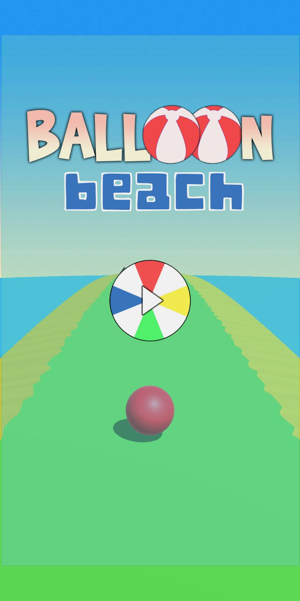

# balloon-beach-unity
Simple endless game for mobile device using C# in Unity with integration of advertisement. 

Reference to : [Udemy Class](https://www.udemy.com/course/unity-basics-a-monetised-mobile-game-in-4-hours/)

Rest of the files :
[Drive](https://drive.google.com/drive/folders/1sCwyv6BGqbzvjHU5_hHkovBWTamGNgWH?usp=sharing)

If you want to install it on your android phone please download the Balloon_Beach.apk file in link above.

 
 
 
 
 

